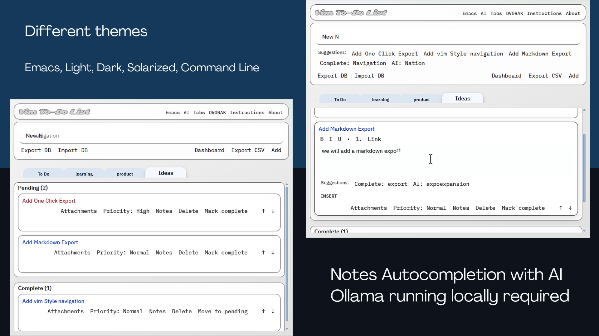

# vim-todo-list

Chrome extension for fast, keyboard-first task notes stored locally in an embedded SQLite database (sql.js/WebAssembly). Opens as a centered overlay with backdrop blur over the current page (click the extension icon or press `Alt+R` / `Ctrl+R` on Mac).



Also available in chrome webstore https://chromewebstore.google.com/detail/vim-todo-list/ofanmcblejkboimkfachgfgimfencdmd

## Features

- Two columns per board: **Pending** and **Complete**
- Multiple **boards** via tabs
- Per-card actions row: **Priority**, **Attachments**, **Notes**, **Delete**, **Mark complete / Move to pending**
- **Reorder cards**: ↑/↓ buttons or drag-and-drop to move cards up or down within Pending or Complete
- Priority levels: `low`, `normal`, `high`
  - Text colors: low = black, normal = blue, high = red
  - Cards are always ordered by priority (high → normal → low)
- Export/Import
  - **Export DB** / **Import DB** for full fidelity
  - **Export CSV** with readable values (dates as `MM/DD/YYYY`, `notes_html` exported as readable text)
- **AI autocompletion (Ollama)**: optional word/phrase suggestions powered by a local LLM
  - Configure via **AI** in the header (endpoint URL, model name)
  - Works alongside local completions (DB, custom words, dictionary)
  - Press `Tab` to accept a suggestion; use arrow keys to cycle through options

## Install (unpacked)

1. Install dependencies:
   - `npm install`
2. Ensure the sql.js vendor files are present:
   - `npm run vendor`
3. Load the extension:
   - Open `chrome://extensions`
   - Enable **Developer mode**
   - Click **Load unpacked**
   - Select this folder

## Usage

- Type a note in **New note** and click **Add**.
- Use **Mark complete** / **Move to pending** to move cards between columns.
- Use **↑** / **↓** or drag-and-drop to reorder cards within Pending or Complete.
- Use **Attachments** to flip the card and manage links.
- Use **Notes** to open the rich notes editor for that card.
- Use **Priority** to cycle `normal → high → low → normal`.

## Themes

- **Light** and **Dark** (default)
- **Solarized Light** and **Solarized Dark**
- **Emacs** (classic light gray)
- **Command Line** (terminal-style: black background, green text, monospace)
- Click the theme button in the header to cycle through options.
- Theme preference is stored in the DB and travels with Export DB / Import DB.

## Keyboard

- Open popup: `Alt+R` (Windows/Linux) or `Ctrl+R` (Mac)
- The popup also includes an in-app **Instructions** view with the full, up-to-date keybindings.
- **Settings** → **Keyboard** chooses **QWERTY** or **Dvorak** mappings (the in-app Instructions update to match).
- **Tabs** and **About** are in the header links row; **Settings** (gear) holds AI, Obsidian, and keyboard options.
- When a word-completion suggestion is shown while typing a new note, press `Tab` to accept it.

## AI autocompletion (Ollama)

The extension can use [Ollama](https://ollama.ai) running locally to suggest completions as you type. Completions are contextual and can span words or phrases.

1. **Install Ollama** on your machine and pull a model (e.g. `ollama pull llama3.2`).
2. Open **Settings** (gear) → **AI** and configure:
   - **Endpoint base URL**: `http://localhost:11434` (Ollama default)
   - **Model name** (optional): e.g. `llama3.2:latest` — leave blank to use your default Ollama model
3. Save. The status LED indicates when the endpoint is reachable.
4. While typing in the **New note** input or **Notes** editor, AI suggestions appear alongside local completions. Press `Tab` to accept; use arrow keys to cycle through options.

**Troubleshooting**

- If the status LED stays on "checking", ensure Ollama is running and reachable at your configured URL.
- On **CORS / 403 errors**, Ollama blocks extension origins by default. Set OLLAMA_ORIGINS on the **machine running Ollama** (local or remote), then **fully restart** Ollama:
  - **Linux (systemd)**: Run `sudo systemctl edit ollama`, add under `[Service]`:
    ```ini
    Environment="OLLAMA_ORIGINS=chrome-extension://*"
    ```
    Then run `sudo systemctl daemon-reload && sudo systemctl restart ollama`. Verify with `systemctl show ollama --property=Environment`.
  - **Windows**: `setx OLLAMA_ORIGINS "chrome-extension://*"` then quit and restart Ollama
  - **macOS**: `launchctl setenv OLLAMA_ORIGINS "chrome-extension://*"` then restart Ollama
  - If that fails, test with `OLLAMA_ORIGINS=*` to allow all origins

## Notes Editor Shortcuts

- **Toggle crossed-out (strikethrough) text for the line:**
   - QWERTY: <kbd>Alt</kbd>+<kbd>H</kbd> (Windows/Linux) or <kbd>Ctrl</kbd>+<kbd>H</kbd> (Mac)
   - DVORAK: <kbd>Alt</kbd>+<kbd>D</kbd> (Windows/Linux) or <kbd>Ctrl</kbd>+<kbd>D</kbd> (Mac)
- Other navigation and editing shortcuts are shown in the in-app Instructions view.

## Data storage

- Notes are stored in a SQLite DB (sql.js) persisted in `chrome.storage.local`.
- DB bytes are stored as Base64 under `sqliteDb_v1`.
- Theme and AI settings are stored in the DB and travel with Export DB / Import DB.

## About

**vim-todo-list** by [Northeastern Software Services LLC](https://northeasternsoftware.com/)

- [GitHub](https://github.com/carlosmva/vim-todo-list)

## Development notes

- `vendor/` contains runtime assets used by the popup (e.g. `sql-wasm.js`, CSS) and is intentionally kept in the repo.
- Icon generation scripts live in `scripts/`.
